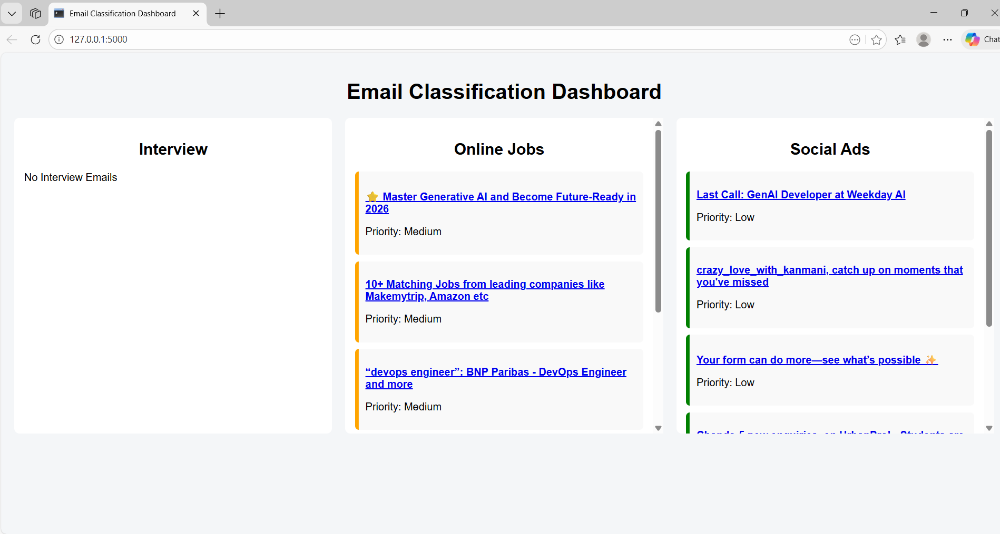

# 📧 Smart Email Classification Dashboard

A full-stack email classification system that automatically categorizes Gmail emails into **Interview**, **Online Job**, and **Social Ads** using an LLM, and displays them in a clean, interactive dashboard.

## 🚀 Features
- Gmail API integration (OAuth 2.0)
- LLM-based email classification
- Priority assignment (High / Medium / Low)
- Flask backend
- HTML/CSS dashboard
- Clickable Gmail emails
- Real-time email fetching

## 🧠 Tech Stack
- Python 3.10
- Flask
- Gmail API
- OAuth 2.0
- LLM (Groq / LLaMA)
- HTML, CSS

## 🖼️ Dashboard Preview

## 🏗️ Project Architecture
Gmail → Backend (LLM) → Flask → Web Dashboard → Gmail

## ⚙️ How to Run
1. Clone the repo
2. Install dependencies  
   `pip install -r requirements.txt`
3. Add `credentials.json`
4. Run  
   `python app.py`
5. Open `http://127.0.0.1:5000`

## 🔒 Security
OAuth tokens and API keys are excluded using `.gitignore`.

## 📌 Future Improvements
- Email caching
- Top-N priority filtering
- ML model fine-tuning
- Docker deployment

